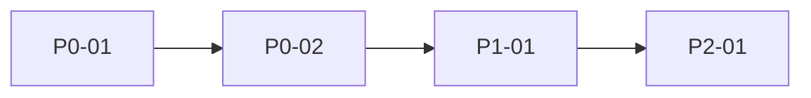

# 基于面试题的项目能力缺口分析

> **项目**：fin-agent-platform  
> **分析日期**：YYYY-MM-DD  
> **题库路径**：`docs/interview-bank/`  
> **题库文件**：`快手/xxx.md`, `海天/yyy.md`, …  
> **证据检索范围**：`app/agents/`, `app/retrieval/`, `tests/`, `docs/`, `.cursor/`, …  
> **说明**：本报告基于代码与文档证据生成；「待验证」项需人工复核。

---

## 1. 面试题覆盖概览

### 题目来源

| 公司/分类 | 文件数 | 原始题数 |
|-----------|--------|----------|
| 快手 | | |
| 上海初创 | | |
| 海天 | | |
| 做B端的小公司 | | |
| **合计** | | |

### 去重统计

- 原始题目数：
- 去重后题目数：
- 合并组数：

### 能力维度分布

| 能力维度 | 题数 | 占比 |
|----------|------|------|
| Agent 完整执行链路 | | |
| 多模型适配 | | |
| 工具定义、注册和调用 | | |
| 工具失败恢复 | | |
| 上下文治理和压缩 | | |
| Memory、RAG 和 Context Engineering | | |
| 重复状态识别 | | |
| Agent Harness | | |
| Benchmark 和评测体系 | | |
| Patch 验证与回滚 | | |
| AI 辅助开发流程 | | |
| 权限、安全和审计 | | |
| 大型代码仓库理解与跨模块修改 | | |

---

## 2. 当前项目整体判断

### 项目当前优势

- 
- 

### 面试中容易讲清楚的内容

- 
- 

### 当前主要短板

- 
- 

### 最容易被追问的问题

1. 
2. 
3. 

---

## 3. 面试题与项目证据映射

| 面试问题 | 考察能力 | 项目证据 | 证据强度 | 当前状态 | 缺口 |
|----------|----------|----------|----------|----------|------|
| | | | | | |
| | | | | | |

### 状态统计

| 状态 | 数量 |
|------|------|
| 已完整支持 | |
| 部分支持 | |
| 缺失 | |
| 有实现但缺少验证 | |
| 不适用于当前项目 | |
| 待验证 | |

---

## 4. P0：面试前必须补充

> 高频面试题 + 明显能力缺口 + 可在短期内闭环。

### [P0-01] 标题

**对应面试题**

**当前项目现状**

**缺少什么**

**建议修改的模块或文件**

**推荐实现方案**

**应补充的测试**

**完成验收标准**
- [ ] 
- [ ] 

**面试表达（完成后）**

**优先级依据**

---

### [P0-02] 标题

（同上结构）

---

## 5. P1：建议完善

### [P1-01] 标题

（同 P0 结构）

---

## 6. P2：长期优化

### [P2-01] 标题

（同 P0 结构，可简化测试与实现方案）

---

## 7. 项目已有但表达不清的能力

> 功能已存在，重点补文档、图示、demo、benchmark，不必改核心代码。

### [表达-01] 能力名称

**已有证据**

**为何面试说不清**

**建议补充（不一定改代码）**

**面试表达**

---

## 8. 建议实施顺序



| 顺序 | 改进项 | 预估工时 | 阻塞项 |
|------|--------|----------|--------|
| 1 | P0-01 | | |
| 2 | P0-02 | | |
| 3 | P1-01 | | |

---

## 9. 面试准备清单

### 必背项目话术（基于真实证据）

- [ ] 用 2 分钟讲清 Agent 主链路（附 `graph.py` 锚点）
- [ ] 用 1 分钟讲清 predefined vs text-to-sql 路由
- [ ] 准备 1 个 tool 失败降级案例
- [ ] 准备 1 个 RAG/检索相关案例
- [ ] 准备 1 个「我不确定/待验证」的诚实回答

### 材料准备

- [ ] 架构图更新（`docs/architecture/`）
- [ ] 可演示的 3 个固定问题
- [ ] P0 改进完成后的 before/after 对比

### 高风险追问预案

| 追问 | 当前回答策略 | 改进后回答策略 |
|------|--------------|----------------|
| | | |

---

## 附录 A：检索日志

记录主要 grep/read 命令与结论，便于复核「待验证」项。

```
# 示例
rg "fallback" app/agents/ → 命中 predefined/node.py
rg "loop" app/agents/ → 无命中
```

## 附录 B：不适用项说明

| 面试题 | 为何不适用于 fin-agent-platform |
|--------|--------------------------------|
| | |
