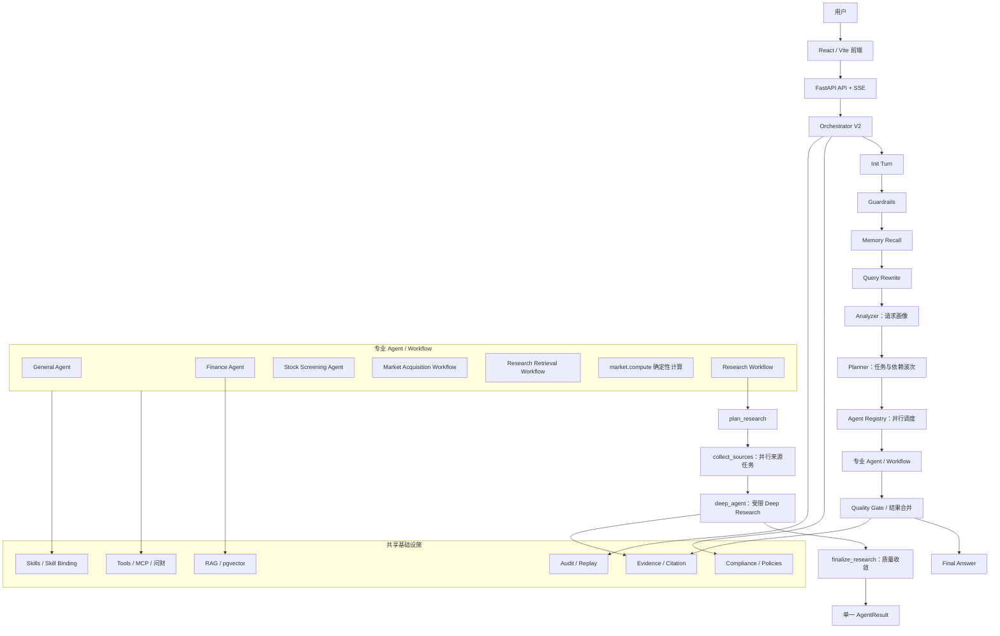
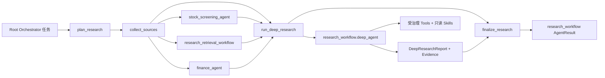

# fin-harness

金融 Multi-Agent 平台。基于 LangGraph 编排多 Agent / Workflow 协作，覆盖财务问答、PDF 研报检索、结构化查数、A 股选股与市场数据计算，并提供合规审查、证据引用与审计能力。

主入口为 **Orchestrator V2**，通过动态任务波次调度各领域 Agent 与 Workflow。

## 功能概览

- **Orchestrator V2**：请求画像 → 规则编计划 → 按依赖波次调度专业 Agent / Workflow
- **Finance Agent**：FAQ、PDF RAG、财务查数（预定义 SQL + Text-to-SQL）、可选联网研究
- **选股与市场数据**：问财选股、受治理市场采集、`CandidateSet` 确定性过滤/排序（`market.compute`）
- **研究工作流**：多源采集 + Deep Agent 分析与质量收敛
- **RAG 检索**：LlamaIndex + pgvector（及可选 ES / Milvus）混合检索
- **Harness 治理**：统一运行上下文、策略、工具注册、合规审查与审计回放
- **Web 前端**：React + Vite 聊天界面，SSE 流式输出执行步骤

## 技术栈

| 层级 | 技术 |
|------|------|
| 后端 | FastAPI · SQLAlchemy · PostgreSQL · Redis |
| Agent | LangGraph · LangChain · DeepSeek · deepagents |
| 检索 | LlamaIndex · pgvector · BM25 ·（可选 Elasticsearch / Milvus） |
| 前端 | React · TypeScript · Vite · Tailwind CSS |

## 快速开始

### 环境要求

- Python 3.11+
- Node.js 18+
- Docker & Docker Compose

### 1. 克隆与依赖

```bash
git clone git@github.com:wooden1234/fin-harness.git
cd fin-harness

python3 -m venv .venv && source .venv/bin/activate
pip install -r requirements.txt

cp .env.example .env
# 编辑 .env，填入 DEEPSEEK_API_KEY、QWEN_API_KEY 等
```

### 2. 启动基础设施

```bash
docker compose up -d
python scripts/init_db.py
python scripts/setup_langgraph_checkpoint.py
```

默认连接信息见 `.env.example`（PostgreSQL `fin:fin@localhost:5432/fin_agent`，Redis `localhost:6379`）。

### 3. 启动后端

```bash
cd app/backend
PYTHONPATH=../.. uvicorn app.main:app --reload --host 127.0.0.1 --port 8010
```

- 健康检查：<http://127.0.0.1:8010/health>
- API 文档：<http://127.0.0.1:8010/docs>

### 4. 启动前端（可选）

```bash
cd app/frontend
npm install
npm run dev
```

前端默认运行在 <http://127.0.0.1:5173>。

### 5. LangGraph Studio（可选）

```bash
langgraph dev
```

在 Studio 中可切换查看：

| Graph | 说明 |
|-------|------|
| `orchestrator_graph` | Root Orchestrator V2 |
| `fin_agent` | Root Orchestrator V2 的通用入口 |
| `finance_agent` | Finance 编排子图 |
| `financial_query_agent` / `predefined_workflow` / `text_to_sql_workflow` | 财务查数相关子图 |
| `fin_agent_combined` | 合图总览 |
| `research_workflow_graph` | 多源研究 + 内部 Deep Research 工作流 |

## 架构要点

```text
用户请求
  → Guardrails / Memory / Query Rewrite
  → Analyzer → Planner → 波次调度 → Quality Gate → Final Answer
```

Orchestrator V2 可调度的主要处理器（见 `agents/orchestrator/agent_registry.py`）：

| ID | 职责 |
|----|------|
| `general_agent` | 无需外部事实的普通对话 |
| `finance_agent` | FAQ / PDF / 财务查数 |
| `stock_screening_agent` | 自然语言 A 股选股（问财） |
| `market_acquisition_workflow` | 受治理市场/行业/指数/基金数据采集 |
| `research_retrieval_workflow` | 公告、研报、机构评级检索 |
| `market.compute` | 对 `CandidateSet` 做确定性 filter / sort / limit |
| `research_workflow` | 多源研究与内部 Deep Agent 分析 |

## 项目图结构



研究工作流内部图：



`agents/research_workflow/deep_agent/` 是研究工作流的内部实现，不再作为 Root Orchestrator 的独立注册 Agent 暴露。

## 项目结构

```
fin-harness/
├── agents/                 # LangGraph Agent / Workflow（Orchestrator、Finance、选股、研究等）
├── app/
│   ├── backend/            # FastAPI 后端（API、模型、服务）
│   └── frontend/           # React 前端
├── retrieval/              # RAG 索引与检索
├── harness/                # 运行治理层
├── tools/                  # 原子工具（SQL、检索、联网等）
├── skills/                 # 业务能力编排（含问财选股 Skill）
├── mcp/                    # MCP 外部系统接入
├── evidence/               # 证据与引用
├── compliance/             # 合规规则与审查
├── audit/                  # 审计与回放
├── evals/                  # 评测与回归脚本
├── scripts/                # 初始化与数据导入
├── tests/                  # 单元与集成测试
├── langgraph_entry.py      # LangGraph Studio / Agent Server 入口
└── langgraph.json          # Studio graph 注册
```

分层约定（详见 `MIGRATION_NOTES.md`）：Agent 负责判断与规划；Skill 编排业务流程；Tool 做原子动作；Harness 负责运行治理。

## 测试

```bash
pytest
```

需要 LLM / Embedding API Key 的集成测试会自动跳过（见 `tests/conftest.py`）。

## 环境变量

关键配置项（完整列表见 `.env.example`）：

| 变量 | 说明 |
|------|------|
| `DEEPSEEK_API_KEY` | DeepSeek LLM API Key |
| `QWEN_API_KEY` | DashScope Embedding API Key |
| `DATABASE_URL` | PostgreSQL 异步连接串 |
| `PGVECTOR_DATABASE_URL` | pgvector 连接串 |
| `LANGGRAPH_CHECKPOINT_URL` | LangGraph 状态持久化 |
| `SECRET_KEY` | JWT 签名密钥 |
| `IWENCAI_API_KEY` | 问财选股 / 市场数据（若启用） |

> `.env` 已在 `.gitignore` 中，请勿提交至仓库。

## License

Private project — all rights reserved.
