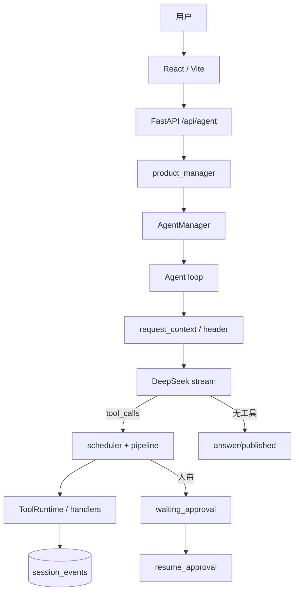

# fin-harness

金融 Agent 平台的 **Harness 主路径**：事件日志驱动的 ReAct 循环，统一工具菜单、人审、失败策略与上下文压缩。产品 HTTP 只走这条线，不再以 LangGraph Orchestrator 作为对外入口。

```text
用户 / 前端
  → FastAPI POST /api/agent/query（SSE）
  → product_manager()（单例 AgentManager）
  → Agent.prompt / resume_approval
  → 每步：拼 Prompt + 工具菜单 → 压缩 → 调模型
  → 有 tool_calls：调度执行 → 错误策略 → 继续 / 暂停审批 / 发布
  → session_events 权威落库；messages 表给人看
```

设计约束见 `harness/adr/00-runtime.md`。

## 功能概览

- **Agent Loop**：turn / step、事件投影 `messages_for_llm`、最多 30 步
- **工具箱**：`ToolRuntime.product()` 底箱 + 每步绑定 todo / memory / finalign
- **领域能力**：问财、本地财报事实、PDF/FAQ、联网搜索、计算；可选 **天眼查 MCP**
- **Skills**：`skill` 工具读取 `skills/*/SKILL.md` 注入上下文
- **治理**：人审、工具错误分类（continue / inject / publish）、上下文压缩
- **Web**：React + Vite 聊天，SSE 投影 public 事件

## 技术栈

| 层级 | 技术 |
|------|------|
| 入口 | FastAPI · SSE · PostgreSQL · Redis |
| Harness | `AgentManager` · `Agent` loop · SessionStore · ToolRuntime |
| 模型 | DeepSeek（规划 / 选工具）；可选本地 finalign 成稿 |
| 工具 | `tools/*` 注册表 · `mcp/`（天眼查 Streamable HTTP）· `skills/` |
| 前端 | React · TypeScript · Vite · Tailwind CSS |

## 快速开始

### 环境要求

- Python 3.11+
- Node.js 18+（前端可选）
- Docker & Docker Compose

### 1. 克隆与依赖

```bash
git clone git@github.com:wooden1234/fin-harness.git
cd fin-harness

python3 -m venv .venv && source .venv/bin/activate
pip install -r requirements.txt

cp .env.example .env
# 至少配置 DEEPSEEK_API_KEY、DATABASE_URL 等
```

### 2. 启动基础设施

```bash
docker compose up -d
python scripts/init_db.py
```

默认连接见 `.env.example`（PostgreSQL / Redis）。

### 3. 启动后端

```bash
cd app/backend
PYTHONPATH=../.. uvicorn app.main:app --reload --host 127.0.0.1 --port 8010
```

- 健康检查：<http://127.0.0.1:8010/health>
- API 文档：<http://127.0.0.1:8010/docs>
- Agent：`POST /api/agent/query`（SSE）；审批恢复 `POST /api/agent/resume`

### 4. 启动前端（可选）

```bash
cd app/frontend
npm install
npm run dev
```

前端默认 <http://127.0.0.1:5173>。

### 5. 本地脚本跑 Loop（可选）

```bash
# 内存 SessionStore，不经产品 HTTP
python -c "import asyncio; from harness.runner import run_agent; print(asyncio.run(run_agent('你好')))"
```

## 架构要点



| 组件 | 作用 |
|------|------|
| `product_manager()` | 进程单例：Postgres store + DeepSeek + `ToolRuntime.product()` |
| `AgentManager` | 按 conversation 找/建 session，缓存 `Agent` 句柄 |
| `Agent` | `prompt` / `resume_approval` / `cancel`；跑 `_steps` |
| `SessionStore` | `agent_sessions` + `session_events`（含压缩事件） |
| `ToolRuntime` | 工具菜单；`openai_tools()` 给模型，`resolve` 给调度 |
| `TurnPolicy` | 工具后 continue / inject / publish；成稿 finalize |

工具配置四步：注册（`tools.core` / MCP adapter）→ 装配底箱与每步绑定 → `openai_tools` 可见 → 模型选中后 scheduler 执行。

## 项目结构（Harness 线）

```
fin-harness/
├── harness/                 # Loop、控制面、压缩、投影、契约
│   ├── agent/               # AgentManager、Agent、RunResult
│   ├── control/             # 审批、TurnPolicy、request_context
│   ├── tools/               # ToolRuntime、scheduler、pipeline、errors
│   ├── session/             # 事件存储与 surface 投影
│   ├── compaction/          # 上下文压缩
│   ├── runtime/             # product_manager 组合根
│   └── adr/                 # 运行时 ADR
├── app/
│   ├── backend/             # FastAPI（/api/agent 走 harness）
│   └── frontend/            # 聊天 UI
├── tools/                   # 领域工具注册（问财、财报、检索等）
├── mcp/                     # MCP（天眼查等）；未配 env 则不注册
├── skills/                  # SKILL.md
├── scripts/                 # init_db 等
└── tests/harness/           # Loop / 工具 / 压缩测试
```

仓库中仍保留 `agents/`、`langgraph_*` 等遗留目录，**产品 Agent 入口以 `harness.runtime.product_manager` 为准**。

## 测试

```bash
pytest tests/harness
```

需要外部 API Key 的用例会按 `tests/conftest.py` 自动跳过。

## 环境变量

关键项（完整列表见 `.env.example`）：

| 变量 | 说明 |
|------|------|
| `DEEPSEEK_API_KEY` | 规划模型 |
| `DATABASE_URL` | PostgreSQL（session / 业务表） |
| `SECRET_KEY` | JWT |
| `IWENCAI_API_KEY` | 问财（若启用） |
| `TYC_MCP_ENABLED` / `TYC_MCP_URL` / `TYC_MCP_TOKEN` | 天眼查 MCP；未配则不进入工具菜单 |
| `FINANCE_LLM_*` / `FINANCE_LLM_DRAFT_ENABLED` | 可选 finalign 成稿 |
| `COMPACTION_CONTEXT_WINDOW` | 压缩窗口（默认见 ADR） |

> `.env` 已在 `.gitignore` 中，请勿提交。

## License

Private project — all rights reserved.
