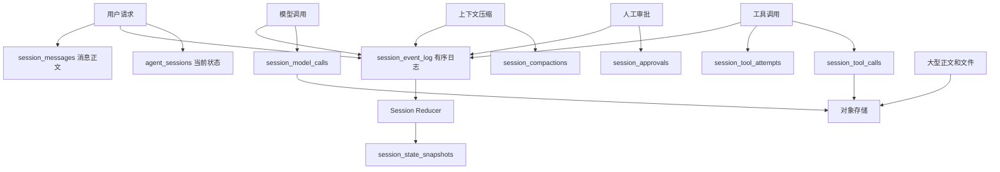

# Session 状态拆分与持久化方案

## 1. 文档目标

本文给出 Harness Session 状态的目标设计与迁移方案，解决以下问题：

- `session_events` 同时承担顺序、状态、消息正文和大结果存储，长期容易膨胀；
- 当前状态主要依赖全量事件重放，长会话恢复成本随事件数量增长；
- 模型上下文压缩与运行状态恢复的职责容易混淆；
- 工具调用中断后缺少稳定的幂等与恢复语义；
- `assistant/chunk` 高频写入会产生不必要的数据库压力；
- 部分关键状态仍保存在进程内存，无法支持可靠的多实例恢复。

本方案采用“轻量事件日志 + 领域状态表 + 状态快照 + 大对象外置”的混合架构。

## 2. 设计原则

1. `session_event_log` 是“发生了什么以及先后顺序”的权威来源。
2. 领域表是“某类对象当前是什么状态”的查询模型。
3. `session_state_snapshots` 用于快速恢复 Harness 执行现场。
4. `session_compactions` 用于缩短 LLM 上下文，不负责恢复执行现场。
5. 原始事件只追加，不原地修改；领域状态可更新。
6. 同一次状态变化的事件与领域记录必须在同一个数据库事务中提交。
7. 大型工具结果、模型原始响应和生成文件不直接塞入事件日志。
8. 任何有副作用的工具都必须支持幂等键或结果状态查询。
9. `agent_sessions` 是当前状态索引，不是最终审计依据。

## 3. 当前实现

当前 Harness 使用：

- `agent_sessions`：Session 元数据和 `next_seq`；
- `session_events`：Session 的全部追加事件；
- `InMemorySessionStore._sessions`：测试环境的内存 Session 映射；
- `AgentManager._agents`：当前进程中的 Agent 实例缓存；
- `Agent` 内存字段：`_published`、`_follow_ups`、`_waiting`、`_abort`。

生产路径通过 `PostgresSessionStore` 将 Session 和事件写入 PostgreSQL。内存中的 `_sessions` 和 `_agents` 不落表，进程重启后会消失。

当前事件契约包含：

```text
turn/start              turn/end
step/start              step/end
user/message            assistant/chunk
assistant/message       tool/call
tool/result             request/header
request/context         todo/write
inbox/spliced           inbox/claimed
inbox/discarded         approval/asked
approval/decided        compaction/start
compaction/summary      compaction/end
answer/published        session/seed-end
invariant/violation
```

其中 `request/context`、`inbox/spliced`、`inbox/discarded`、`session/seed-end` 当前只有契约或投影，尚未发现生产写入点，应在迁移时决定补齐还是删除。

## 4. 目标总体结构



目标表：

| 表 | 职责 | 是否权威 |
|---|---|---|
| `agent_sessions` | Session 当前状态与快速索引 | 派生状态 |
| `session_event_log` | 全局有序、轻量、不可变事件 | 是 |
| `session_messages` | 用户消息、模型消息、最终答案 | 内容权威 |
| `session_model_calls` | 每次模型请求及结果元信息 | 调用权威 |
| `session_tool_calls` | 一次逻辑工具调用的当前状态 | 调用权威 |
| `session_tool_attempts` | 工具的每一次实际尝试 | 尝试权威 |
| `session_approvals` | 待审批事项与决定 | 审批权威 |
| `session_compactions` | 模型上下文摘要及覆盖范围 | 上下文权威 |
| `session_todo_snapshots` | 每次完整 Todo 快照 | Todo 权威 |
| `session_state_snapshots` | 某个 seq 时的运行状态 | 可重建缓存 |

## 5. 表结构建议

### 5.1 `agent_sessions`

保存当前状态与游标，不保存用户问题正文。

```sql
CREATE TABLE app.agent_sessions (
    session_id UUID PRIMARY KEY,
    tenant_id VARCHAR(36) NOT NULL,
    user_id VARCHAR(36) NOT NULL,
    conversation_id VARCHAR(64),

    status VARCHAR(32) NOT NULL DEFAULT 'idle',
    current_run_id UUID,
    current_turn INTEGER NOT NULL DEFAULT 0,
    current_step INTEGER NOT NULL DEFAULT 0,
    next_seq BIGINT NOT NULL DEFAULT 1,
    last_event_seq BIGINT NOT NULL DEFAULT 0,

    pending_approval_id UUID,
    latest_compaction_id UUID,
    last_compacted_seq BIGINT NOT NULL DEFAULT 0,
    latest_snapshot_seq BIGINT NOT NULL DEFAULT 0,

    created_at TIMESTAMPTZ NOT NULL DEFAULT NOW(),
    updated_at TIMESTAMPTZ NOT NULL DEFAULT NOW(),

    UNIQUE (tenant_id, user_id, conversation_id)
);
```

推荐状态：

```text
idle
running
waiting_approval
completed
failed
cancelled
recovering
```

### 5.2 `session_event_log`

只维护事件顺序、关联关系和轻量元数据，不保存大正文。

```sql
CREATE TABLE app.session_event_log (
    event_id UUID PRIMARY KEY,
    session_id UUID NOT NULL REFERENCES app.agent_sessions(session_id),
    seq BIGINT NOT NULL,
    event_type VARCHAR(80) NOT NULL,
    schema_version INTEGER NOT NULL DEFAULT 1,

    run_id UUID,
    turn INTEGER,
    step INTEGER,
    causation_seq BIGINT,
    correlation_id UUID,

    visibility VARCHAR(16) NOT NULL DEFAULT 'internal',
    payload_kind VARCHAR(32),
    payload_id VARCHAR(128),
    metadata JSONB NOT NULL DEFAULT '{}',
    created_at TIMESTAMPTZ NOT NULL DEFAULT NOW(),

    UNIQUE (session_id, seq)
);

CREATE INDEX ix_session_event_log_session_seq
    ON app.session_event_log(session_id, seq);

CREATE INDEX ix_session_event_log_run
    ON app.session_event_log(run_id, seq);
```

示例：

```text
seq=1  turn/start         payload_id=NULL
seq=2  user/message       payload_id=msg-001
seq=3  request/header     payload_id=model-call-001
seq=4  assistant/message  payload_id=msg-002
seq=5  tool/call          payload_id=call-001
seq=6  tool/result        payload_id=call-001
```

### 5.3 `session_messages`

```sql
CREATE TABLE app.session_messages (
    message_id UUID PRIMARY KEY,
    session_id UUID NOT NULL,
    run_id UUID,
    turn INTEGER,
    step INTEGER,
    role VARCHAR(20) NOT NULL,
    source VARCHAR(32),
    content TEXT NOT NULL DEFAULT '',
    tool_calls JSONB,
    published BOOLEAN NOT NULL DEFAULT FALSE,
    created_at TIMESTAMPTZ NOT NULL DEFAULT NOW()
);

CREATE INDEX ix_session_messages_surface
    ON app.session_messages(session_id, turn, step, created_at);
```

保存：

- `user/message` 正文；
- 完整的 `assistant/message`；
- `answer/published` 的最终答案。

`assistant/chunk` 默认不永久落库。它通过 Redis Stream、Pub/Sub 或当前进程的 SSE 通道传输；如需断线续传，可短期保存在 Redis，并设置 TTL。

### 5.4 `session_model_calls`

```sql
CREATE TABLE app.session_model_calls (
    model_call_id UUID PRIMARY KEY,
    session_id UUID NOT NULL,
    run_id UUID NOT NULL,
    turn INTEGER NOT NULL,
    step INTEGER NOT NULL,

    provider VARCHAR(64),
    model VARCHAR(128),
    status VARCHAR(32) NOT NULL,
    system_prompt_hash VARCHAR(64),
    tools_hash VARCHAR(64),
    source_from_seq BIGINT,
    source_to_seq BIGINT,
    request_ref VARCHAR(256),
    response_message_id UUID,

    input_tokens INTEGER,
    output_tokens INTEGER,
    latency_ms INTEGER,
    finish_reason VARCHAR(32),
    error_code VARCHAR(128),
    created_at TIMESTAMPTZ NOT NULL DEFAULT NOW(),
    completed_at TIMESTAMPTZ
);
```

至少记录模型实际读取的事件范围和 Prompt/Tools 哈希。严格 replay 场景可以把完整请求存入对象存储，通过 `request_ref` 引用。

### 5.5 `session_tool_calls`

一次逻辑调用一行，保存最终状态。

```sql
CREATE TABLE app.session_tool_calls (
    call_id VARCHAR(128) PRIMARY KEY,
    session_id UUID NOT NULL,
    run_id UUID NOT NULL,
    turn INTEGER NOT NULL,
    step INTEGER NOT NULL,

    tool_name VARCHAR(128) NOT NULL,
    arguments JSONB NOT NULL,
    arguments_hash VARCHAR(64) NOT NULL,
    idempotency_key VARCHAR(160) NOT NULL,
    status VARCHAR(32) NOT NULL,
    attempt_count INTEGER NOT NULL DEFAULT 0,

    result_preview JSONB,
    result_ref VARCHAR(256),
    result_hash VARCHAR(64),
    evidence_id VARCHAR(128),
    error_code VARCHAR(128),
    error_class VARCHAR(64),

    created_at TIMESTAMPTZ NOT NULL DEFAULT NOW(),
    started_at TIMESTAMPTZ,
    completed_at TIMESTAMPTZ,

    UNIQUE (idempotency_key)
);
```

推荐状态：

```text
pending
waiting_approval
running
succeeded
failed
unknown
cancelled
```

### 5.6 `session_tool_attempts`

每次实际尝试都写，不是只有失败时才写。

```sql
CREATE TABLE app.session_tool_attempts (
    attempt_id UUID PRIMARY KEY,
    call_id VARCHAR(128) NOT NULL REFERENCES app.session_tool_calls(call_id),
    attempt_no INTEGER NOT NULL,
    status VARCHAR(32) NOT NULL,
    error_code VARCHAR(128),
    latency_ms INTEGER,
    started_at TIMESTAMPTZ NOT NULL,
    completed_at TIMESTAMPTZ,

    UNIQUE (call_id, attempt_no)
);
```

第一次失败、第二次成功时：

```text
session_tool_calls:
  call-001  status=succeeded  attempt_count=2

session_tool_attempts:
  call-001  attempt=1  failed     upstream_timeout
  call-001  attempt=2  succeeded
```

### 5.7 `session_approvals`

```sql
CREATE TABLE app.session_approvals (
    approval_id UUID PRIMARY KEY,
    session_id UUID NOT NULL,
    run_id UUID NOT NULL,
    call_id VARCHAR(128) NOT NULL,
    status VARCHAR(32) NOT NULL,
    requested_data JSONB NOT NULL DEFAULT '{}',
    decision VARCHAR(16),
    decided_by VARCHAR(64),
    requested_at TIMESTAMPTZ NOT NULL DEFAULT NOW(),
    decided_at TIMESTAMPTZ
);
```

推荐状态：`pending`、`allowed`、`denied`、`expired`、`cancelled`。

### 5.8 `session_compactions`

`session_compactions` 回答“前面讨论了什么”，服务于 LLM 上下文。

```sql
CREATE TABLE app.session_compactions (
    compaction_id UUID PRIMARY KEY,
    session_id UUID NOT NULL,
    run_id UUID NOT NULL,
    turn INTEGER NOT NULL,
    status VARCHAR(32) NOT NULL,

    source_from_seq BIGINT NOT NULL,
    source_to_seq BIGINT NOT NULL,
    source_event_seqs JSONB,
    schema_version INTEGER NOT NULL DEFAULT 1,

    summary TEXT NOT NULL DEFAULT '',
    structured_summary JSONB,
    summary_tokens INTEGER,
    created_at TIMESTAMPTZ NOT NULL DEFAULT NOW(),
    committed_at TIMESTAMPTZ
);
```

只有 `status=committed` 的摘要能够参与上下文构建。摘要替代指定范围的模型可见历史，但不删除原始消息和事件。

### 5.9 `session_todo_snapshots`

```sql
CREATE TABLE app.session_todo_snapshots (
    snapshot_id UUID PRIMARY KEY,
    session_id UUID NOT NULL,
    run_id UUID NOT NULL,
    turn INTEGER NOT NULL,
    version INTEGER NOT NULL,
    todos JSONB NOT NULL,
    created_at TIMESTAMPTZ NOT NULL DEFAULT NOW(),

    UNIQUE (session_id, turn, version)
);
```

Todo 使用整表替换语义，读取最新版本即可得到当前 Todo 状态。

### 5.10 `session_state_snapshots`

`session_state_snapshots` 回答“系统现在执行到哪里”，服务于 Harness 恢复。

```sql
CREATE TABLE app.session_state_snapshots (
    snapshot_id UUID PRIMARY KEY,
    session_id UUID NOT NULL,
    snapshot_seq BIGINT NOT NULL,
    schema_version INTEGER NOT NULL DEFAULT 1,

    current_run_id UUID,
    current_turn INTEGER,
    current_step INTEGER,
    run_status VARCHAR(32),
    pending_approval_id UUID,
    pending_call_ids JSONB NOT NULL DEFAULT '[]',
    published_message_id UUID,
    latest_compaction_id UUID,
    state JSONB NOT NULL,

    created_at TIMESTAMPTZ NOT NULL DEFAULT NOW(),
    UNIQUE (session_id, snapshot_seq)
);
```

快照不是新的权威来源。任何快照都必须能够通过事件重放重新生成。

## 6. Compaction 与 State Snapshot 的区别

| 对比项 | `session_compactions` | `session_state_snapshots` |
|---|---|---|
| 核心问题 | 前面讨论了什么 | 系统执行到哪里 |
| 使用者 | LLM Context Builder | Harness Runtime |
| 内容 | 对话、事实、开放事项摘要 | turn、step、审批、工具、运行状态 |
| 是否可能包含业务事实 | 是 | 通常只保存状态引用 |
| 触发条件 | Token 压力 | 事件数量、关键状态边界 |
| 几天后正常续聊 | 使用 | 通常不需要恢复旧 Run |
| 崩溃后续跑 | 可能辅助 | 必须使用或完整重放 |

简单记忆：

```text
compaction    = 给模型缩短记忆
state snapshot = 给系统快速恢复现场
```

## 7. 关键执行流程

### 7.1 用户提出新问题

在同一个数据库事务中：

1. 锁定或创建 `agent_sessions`；
2. 分配 `seq`；
3. 写 `session_messages` 用户正文；
4. 写 `session_event_log(user/message)` 并引用 `message_id`；
5. 更新 `agent_sessions.current_turn/status/last_event_seq`；
6. 提交事务。

`agent_sessions` 不保存问题正文。

### 7.2 模型调用

1. Context Builder 生成模型可见上下文；
2. 写 `session_model_calls(status=running)`；
3. 写 `session_event_log(request/header)`；
4. 流式 chunk 走 SSE/Redis，不永久逐块落库；
5. 完成后写 `session_messages(assistant)`；
6. 更新 `session_model_calls(status=succeeded)`；
7. 写 `session_event_log(assistant/message)`。

### 7.3 工具调用与重试

1. 创建 `session_tool_calls(status=pending)`；
2. 写 `session_event_log(tool/call)`；
3. 每次实际执行创建一行 `session_tool_attempts`；
4. 成功后更新逻辑调用为 `succeeded`；
5. 失败且可重试时继续增加 attempt；
6. 最终写 `session_event_log(tool/result)`。

有副作用的工具通过 `idempotency_key` 防止重复执行。

### 7.4 上下文压缩

1. 选择待压缩的模型可见事件范围；
2. 创建 `session_compactions(status=building)`；
3. 生成并校验摘要；
4. 更新为 `committed`；
5. 写压缩提交事件；
6. 更新 `agent_sessions.latest_compaction_id/last_compacted_seq`。

压缩失败时原上下文继续有效，不能使用未提交摘要。

### 7.5 正常结束后，几天后继续会话

如果最后一个 Turn 已完成：

```text
读取 agent_sessions
  -> 读取最新 committed compaction
  -> 读取 compaction.source_to_seq 之后的模型可见增量
  -> 追加本次新问题
  -> 开启新的 turn
```

模型上下文为：

```text
system prompt
+ 最新压缩摘要
+ 压缩范围之后的 user/assistant/tool/context 增量
+ 用户本次新问题
```

历史摘要中的行情、新闻等时效数据只能作为历史事实。用户询问“当前”“今天”“最新”时必须重新调用工具。

### 7.6 执行中断后恢复

如果旧 Turn 没有 `turn/end`：

```text
读取最新 state snapshot
+ 重放 snapshot_seq 之后的 event log
= 当前 SessionState
```

然后检查：

- `waiting_approval`：恢复审批等待；
- `tool_call=running`：按工具恢复策略处理；
- `tool_call=unknown`：查询外部状态或转人工；
- `model_call=running`：通常废弃旧流并重新发起模型调用；
- 已完成但未发布：继续 finalization；
- 已发布但未 `turn/end`：补齐幂等终止事件。

## 8. Session Reducer

应新增纯函数 Reducer，禁止各模块自行猜测 Session 当前状态。

```python
def reduce_session(
    snapshot: SessionState | None,
    events: Sequence[SessionEvent],
) -> SessionState:
    ...
```

输出至少包含：

```text
current_run_id
current_turn
current_step
status
pending_approval_id
pending_tool_calls
published_message_id
latest_compaction_id
latest_todos
last_event_seq
```

Reducer 必须满足：

- 确定性：相同输入一定得到相同状态；
- 幂等：重复事件不能造成二次副作用；
- 版本化：按 `schema_version` 兼容历史事件；
- 可测试：用完整重放验证快照结果。

## 9. 事务与一致性

拆表后最大的风险是双写不一致，因此写操作必须走统一的 `SessionUnitOfWork`：

```text
BEGIN
  SELECT agent_sessions ... FOR UPDATE
  分配 session seq
  写领域表
  写 session_event_log
  更新 agent_sessions 当前状态和 last_event_seq
COMMIT
```

禁止：

```text
先提交领域表
再单独提交事件表
```

否则可能出现工具已经成功，但事件日志没有结果的情况。

需要跨数据库或对象存储时：

1. 先写临时对象；
2. 数据库事务保存对象引用和哈希；
3. 事务成功后确认对象；
4. 通过 Outbox 清理孤儿对象或完成后续发布。

## 10. 并发控制

当前 `AgentManager` 默认使用内存 Lease，只能约束单进程。目标方案应启用数据库 Lease 或 Redis Lease：

```text
session_id
owner_id
lease_token
expires_at
fencing_token
```

所有状态写入携带 `fencing_token`，旧持有者 Lease 过期后不能继续提交。

数据库仍通过 `(session_id, seq)` 唯一约束保证事件序号不重复，但序号唯一不能替代业务层 Lease；两个 Agent 即使拿到不同 seq，也可能错误地交错推进同一个 Session。

## 11. 大字段与保留策略

### PostgreSQL 长期保存

- 轻量事件索引；
- Session 当前状态；
- 用户和 assistant 最终消息；
- 工具状态和小型结果摘要；
- 审批状态；
- 压缩摘要；
- 状态快照。

### Redis 短期保存

- `assistant/chunk`；
- SSE 断线续传窗口；
- 可过期的等待通知；
- 分布式 Lease（若不使用数据库 Lease）。

### 对象存储保存

- 大型工具结果；
- 搜索原文；
- PDF 和生成报告；
- 可选的完整模型请求/响应；
- 大型附件和中间产物。

事件或领域表只保存：

```json
{
  "result_ref": "object://tool-results/call-001.json",
  "result_hash": "sha256:...",
  "size": 158000,
  "preview": "..."
}
```

## 12. 查询路径

| 场景 | 查询来源 |
|---|---|
| 用户历史对话 | `session_messages` |
| 构建模型上下文 | 最新 `session_compactions` + 压缩后的模型可见增量 |
| 查看当前状态 | `agent_sessions` |
| 崩溃恢复 | `session_state_snapshots` + 增量 `session_event_log` |
| 工具恢复 | `session_tool_calls` + `session_tool_attempts` |
| 审批恢复 | `session_approvals` |
| SSE 回放 | `session_event_log`，正文按引用查询 |
| 完整审计 | `session_event_log` + 领域表 + 对象存储 |

## 13. 索引、分区与归档

第一阶段推荐索引：

```text
session_event_log(session_id, seq)
session_event_log(run_id, seq)
session_messages(session_id, turn, step)
session_tool_calls(session_id, status)
session_tool_calls(idempotency_key) UNIQUE
session_approvals(session_id, status)
session_compactions(session_id, status, source_to_seq)
session_state_snapshots(session_id, snapshot_seq DESC)
```

数据量达到千万级后，再对 `session_event_log` 按月做时间分区；如果租户隔离和单租户导出是主要需求，可以评估按 `tenant_id` 哈希分区。不要过早分区。

完成较久的 Session 可以迁移到冷分区，但必须保留：

- Session 元数据；
- 最终消息；
- 最新有效压缩摘要；
- 对象引用与哈希；
- 合规要求范围内的审计日志。

## 14. 分阶段迁移

### 阶段 0：明确契约

- 冻结当前事件类型和 payload；
- 给每种事件增加 Pydantic schema；
- 确认未使用事件是实现还是移除；
- 为事件增加 schema migration 测试。

### 阶段 1：先降低数据库写压力

- 停止永久逐条写 `assistant/chunk`；
- 大型 `tool/result` 外置；
- 所有读取改为 `after_seq` 增量读取；
- 保留现有 `session_events` 行为。

### 阶段 2：拆出高价值状态表

- 新建 `session_tool_calls`；
- 新建 `session_tool_attempts`；
- 新建 `session_approvals`；
- 引入工具幂等键；
- 双写旧事件表和新领域表，并执行一致性校验。

### 阶段 3：拆消息和模型调用

- 新建 `session_messages`；
- 新建 `session_model_calls`；
- SSE 和 UI 切换到新读取路径；
- 事件日志改为保存 payload 引用。

### 阶段 4：拆压缩并引入 Reducer

- 新建 `session_compactions`；
- 实现统一 Context Builder；
- 实现纯函数 Session Reducer；
- 增加 `session_state_snapshots`；
- 用全量事件重放校验快照。

### 阶段 5：切换权威路径

- 将 `session_events` 收窄并迁移为 `session_event_log`；
- 产品读取切到领域表和快照；
- 保留事件日志用于顺序、审计和恢复；
- 停止旧 JSON payload 双写；
- 完成历史数据回填与一致性验收。

## 15. 验收标准

### 功能验收

- 正常对话可从最新 Compaction 加增量消息继续；
- 等待审批时重启服务，能够恢复审批；
- 工具执行中重启，不会重复产生副作用；
- 已发布答案不会被重复发布；
- 压缩失败不会污染模型上下文；
- 快照删除后仍可通过事件完整重建状态。

### 一致性验收

- 每个领域状态变化都有对应事件；
- 每个事件引用的领域记录存在；
- `agent_sessions.last_event_seq` 等于日志最大 seq；
- 快照状态等于从头重放到 `snapshot_seq` 的 Reducer 结果；
- 工具同一 `idempotency_key` 最多产生一次业务副作用。

### 性能验收

- 长会话恢复不再读取全部历史事件；
- 单次上下文构建只读取最新摘要和增量；
- 流式输出不会形成大量 PostgreSQL 小事务；
- 大型工具结果不会显著增大事件表行尺寸；
- Session 热查询使用 `(session_id, seq)` 索引。

## 16. 推荐第一版范围

第一版不必立即建立全部表，建议优先实现：

```text
agent_sessions
session_event_log
session_messages
session_model_calls
session_tool_calls
session_tool_attempts
session_approvals
session_compactions
```

同时完成：

- `assistant/chunk` 改为短期流；
- 工具结果大字段外置；
- 数据库或 Redis Lease；
- 统一事务写入入口；
- 最新摘要加增量的 Context Builder。

当需要支持长任务、任意中断恢复或多 Sub Agent 后，再正式启用 `session_state_snapshots` 和完整 Session Reducer。

## 17. 最终结论

目标设计不是彻底取消统一事件日志，而是将它收窄为轻量、严格有序的事实索引：

```text
session_event_log       决定发生了什么及先后顺序
领域状态表              决定各对象当前是什么状态
session_compactions     让模型以更短上下文继续对话
session_state_snapshots 让 Harness 快速恢复执行现场
对象存储                承载大型内容和生成产物
```

这样既保留审计、重放和顺序一致性，也避免消息正文、工具大结果、流式 chunk、审批状态和压缩摘要长期堆积在同一张 JSON 事件表中。
